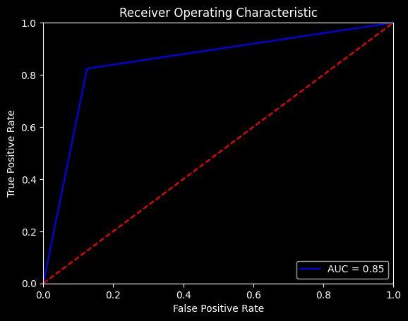

## Project Overview

In today's dynamic business landscape, understanding customer behavior and optimizing service offerings is a primary goal. Knowing the intentions of your clients as a business gives insights about your next moves, driving decision-making.

The "Premium Service Enrollment Prediction" project represents an attempt to predict whether an app user will purchase the premium offer or not based on their interactions with the app.

By delving into predictive analytics, the project not only enhances understanding of customer behavior but also equips the business with actionable insights, enabling strategic optimization of service offerings and resource allocation for maximum impact in a dynamic and competitive market.

It also allows real-time inference of new customers by making predictions using the Streamlit app put there.

You can try the app using the Streamlit view from [https://premiumenrollement.streamlit.app/](https://premiumenrollement.streamlit.app/).

## Built with

## Project Methodology:
#### From Problem to Approach: Asking the right questions

- Business Understanding:  What is the Business Objective ?
     * The objective is to **predict** whether a costumer will enroll to the app's premius service or not **based on their user data**
- Use Case :
    * We want to target the users who are less likely to enroll to make them enroll through campaigns .
    
- Understanding our ML Pipeline
       * Input : User Data from app_data database
       * output : Enrollment values ( 0 or 1)
- Framing the Problem :
     * The problem here is a typical **supervised learning task** since we have Labeled Training examples
- Designing the System
     * The Value of the output is 0 or 1 So the goal is **to predict a binary value** .
     * This is a **regression task** since we are asked to **PREDICT A VALUE**
     * It is a **Univariate Regression problem** since we Have **one single dependent value to predict** which is "Enrolled"
- Selecting a performance measure
     * We are going to test the follwing : ROC Curve (AUC), classification Report and Confusion Matrix.

## A few Definitions
* **Machine Learning Pipeline**  :
  A pipeline is a sequence of data processing components .
Components typically run **asynchronously** which means that Each component pulls in a large amount
of data, processes it, and spits out the result in another data storage. Then, some time later (not instantly), the next component in the pipeline pulls this data and spits out its own output .
* **Logistic Regression** : (also called Logit Regression) is commonly used to estimate the probability that an instance belongs to a particular class . If the estimated probability is greater than 50%, then the model predicts that the instance belongs to that class (called the positive class, labeled “1”), and otherwise it predicts that it does not (i.e., it belongs to the negative class, labeled “0”). This makes it a binary classifier.
* **Test Set** :  A test set is used to estimate the generalization error that a model will make on new instances, before the model is launched in production

### Project Components

- Analyzed and preprocessed data to ensure data quality and integrity.
- Built a Machine Learning Model to predict the probability of a user purchasing the premium offer.
- Evaluated and deployed the model as a streamlit web app.

### Tools and Technology

- Python, Scikit Learn, Pandas, Numpy, Matplotlib, Seaborn
- Streamlit Web App
- Jupyter Notebook, Visual Studio Code, Git, GitHub

### Metrics and Results

The project evaluation metrics include Confusion Matrix, Precision and Recall, and ROC AUC Curves. Here are some of the results:
<h3 align="center">Classification Metrics</h3>

| Metric          | Score               |
|-----------------|---------------------|
| Precision Score | 0.9128              |
| Recall Score    | 0.8239              |
| F1 Score        | 0.8661              |

<h3 align="center">Confusion Matrix</h3>

  

<h3 align="center">AUC ROC Curves</h3>

  

### Dependencies:
- Python 3.10.11
- streamlit 

### Instructions to Try the Project:

* Clone Repo:
~~~ 
git clone https://github.com/Hypatchia/premiuemenrollmentprediction
~~~

* Navigate to Repo's directory
~~~
cd PremiumEnrollementPrediction
~~~
* Create virtual environment
~~~
python -m venv myenv
~~~

* Activate venv
~~~
source <path_to_environmeent>/myenv/activate
~~~
* Install requirements.txt
~~~
pip install -r requirements.txt
~~~

* Run Streamlit Server:
~~~
streamlit run app.py
~~~

* Navigate to saved_models
- Copy and past.pkl saved model to root directory (where app.py is)
* Navigate to Processed_dataset
- Upload the test_data.csv to app.

## Contact
 Feel free to reach out to me on LinkedIn or through email & don't forget to visit my portfolio.
 

